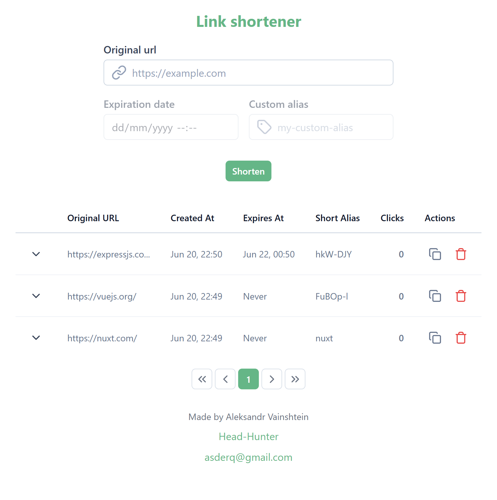

# URL Shortener API — Test Assignment


## 📋 Brief

Develop a REST API for a URL shortening service and a frontend (React or Vue) for testing the API. Use TypeScript for both frontend and backend. The project must be runnable with a single Docker Compose command.

## 🛠️ Stack / Стек

- TypeScript
- Express.js (backend)
- Vue 3 (frontend)
- PostgreSQL (DB)
- Prisma ORM
- Vitest (tests)
- Docker, Docker Compose

---

<details>
<summary>📋 Task (in English)</summary>

### Goal

Develop a REST API for a URL shortening service and a frontend for testing the API. Use TypeScript for both frontend and backend. The project must be runnable with a single Docker Compose command.

#### Backend

**Required features:**
1. Create short link:
   - `POST /shorten` — accepts JSON with:
     - `originalUrl` (required)
     - `expiresAt` (optional)
     - `alias` (optional, max 20 chars)
   - Returns a unique shortened URL.
2. Redirect:
   - `GET /{shortUrl}` — redirects to the original URL. Returns 404 if not found.
3. Get link info:
   - `GET /info/{shortUrl}` — returns original URL, creation date, click count.
4. Delete short link:
   - `DELETE /delete/{shortUrl}` — deletes the short link.
5. Click analytics:
   - Store date and IP for each click.
   - `GET /analytics/{shortUrl}` — returns click count and last 5 IPs.
6. Tests (1-2):
   - Check unique alias creation.
   - Check redirection to original URL.

**Tech:** Express.js or NestJS, PostgreSQL/MySQL/MariaDB, ORM.

#### Frontend

- UI for creating, deleting, and viewing short links and their analytics.

</details>

<details>
<summary>📋 Задание (на русском)</summary>

### Цель

Разработать REST API для сервиса сокращения ссылок и фронтенд для тестирования API. Использовать TypeScript для фронта и бэка. Проект должен запускаться одной командой через Docker Compose.

#### Backend

**Обязательный функционал:**
1. Создание короткой ссылки:
   - `POST /shorten` — принимает JSON с:
     - `originalUrl` (обязательно)
     - `expiresAt` (опционально)
     - `alias` (опционально, до 20 символов)
   - Возвращает уникальный короткий URL.
2. Переадресация:
   - `GET /{shortUrl}` — редирект на оригинальный URL. 404, если не найдено.
3. Получение информации:
   - `GET /info/{shortUrl}` — оригинальный URL, дата создания, количество переходов.
4. Удаление ссылки:
   - `DELETE /delete/{shortUrl}` — удаляет короткую ссылку.
5. Статистика переходов:
   - Сохранять дату и IP каждого перехода.
   - `GET /analytics/{shortUrl}` — количество переходов и последние 5 IP.
6. Тесты (1-2):
   - Проверить создание уникального alias.
   - Проверить редирект на оригинальный URL.

**Технологии:** Express.js или NestJS, PostgreSQL/MySQL/MariaDB, ORM.

#### Frontend

- UI для создания, удаления и просмотра коротких ссылок и их статистики.

</details>

---

## 🚀 Quick Start

```sh
docker compose up
```

This will start all required project services.

To run backend tests:

```sh
cd backend/express
yarn
vitest
```


